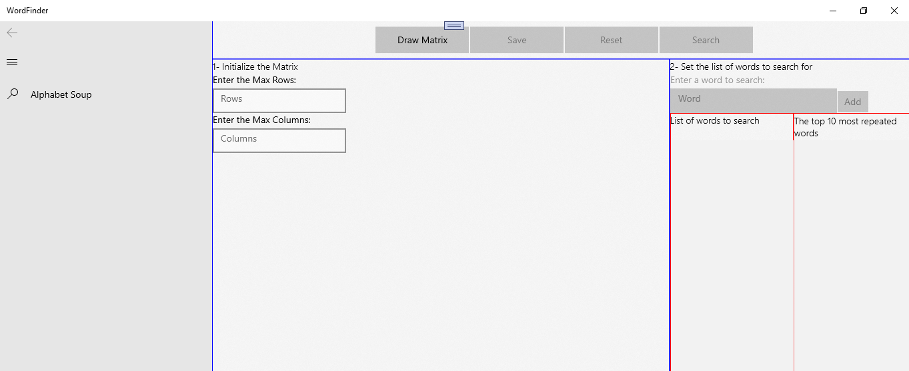
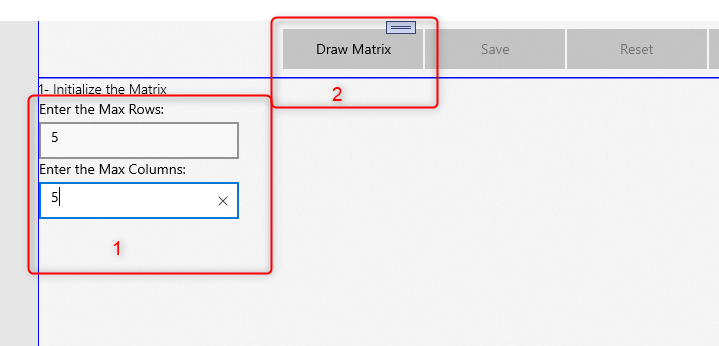
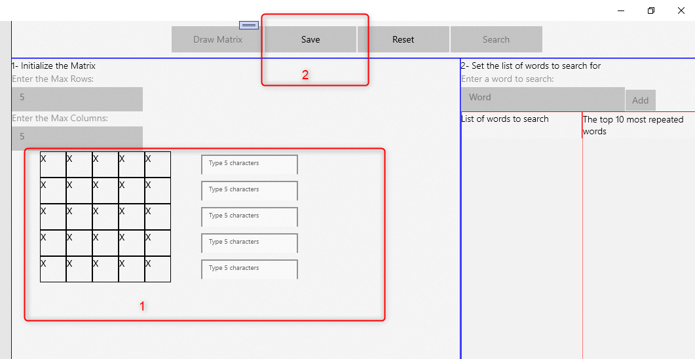
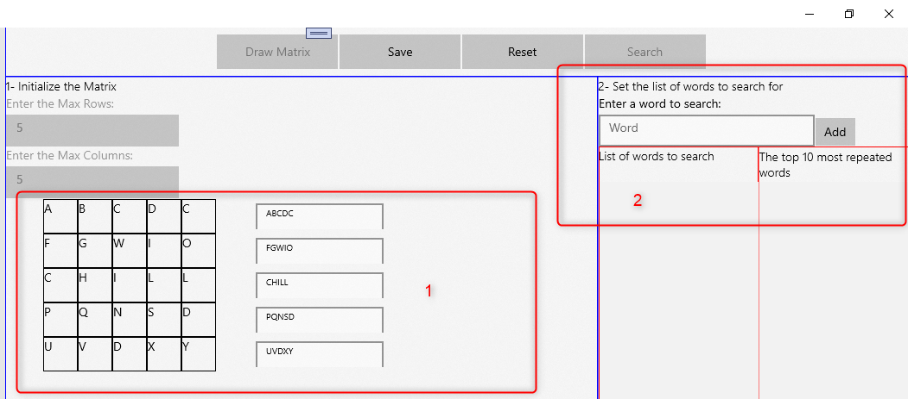
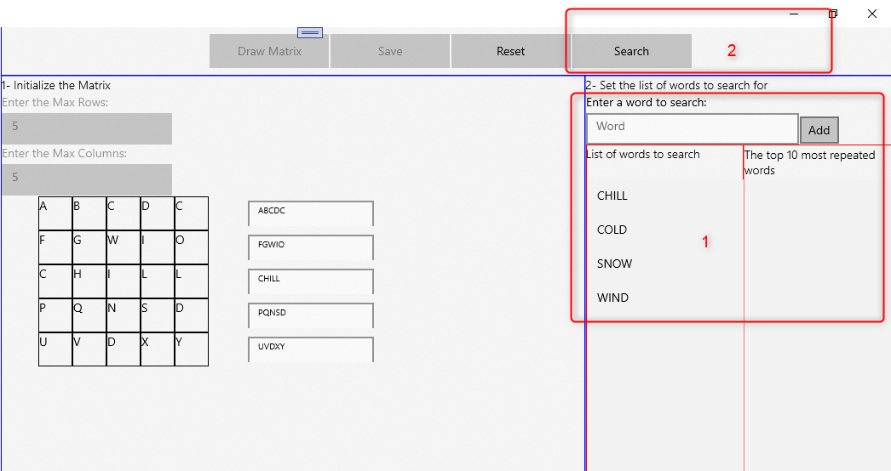
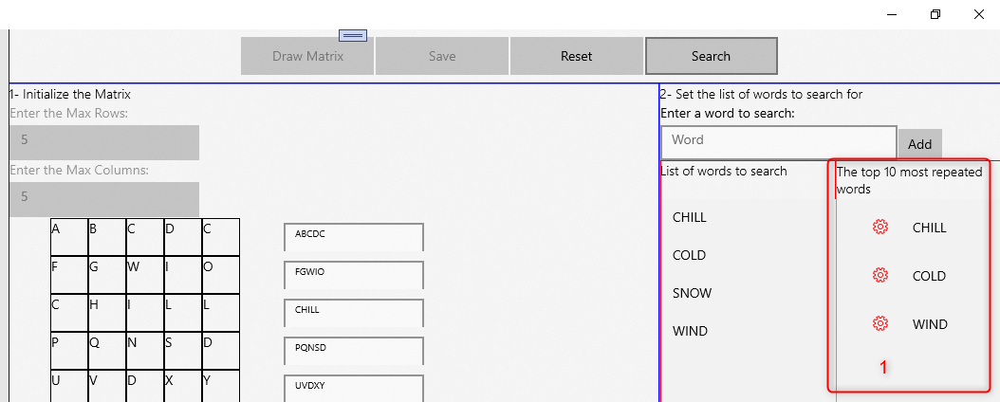
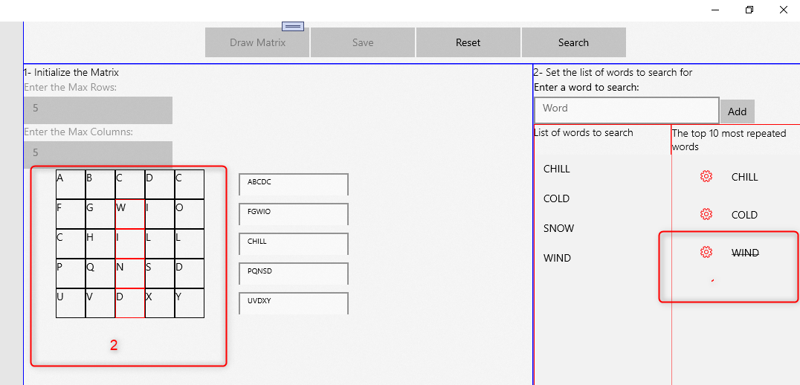

1- Requerimientos minimos:
- Visual Studio 2019
- Windows 10, version 1809 - 2004 (Build 17763 - 19041)

2- Cómo usar la App:

Al iniciar tenemos la pantalla principal:

De entrada están habilitado los text boxes para definir las Filas y Columnas de la Matríz (1), así como el botón para dibujar la Matríz (2):

Una vez la Matríz se ha dibujado, se tiene que ingresar el texto de cada file (1). Y, entonces, dar clic en el botón Save (2) , se crea IEnumerable<string> matrix:

Una vez la matríz se llene correctamente con text (1), se habilta otra área, para agregar la lista de palabras(2), se crea IEnumerable<string> wordstream:

Una vez se tiene la lista de palabras a buscar/IEnumerable<string> wordstream (1), dar clic en el botón Search (2):

Se obtiene una lista de máximo 10 palabras (1):

Al hacer clic en el botón rojo de cada pabra, ésta se tacha (1), la pabra en la Matríz es resalta (2):

3- Clase WordFinder.cs
Esta se encuentra en el folder DATA\WordFinder.cs

La cual recibe, en el Metodo Constructor, una lista, que representa la Matríz.

Y, tiene un metodo que retorna las 10 palabras más repetidas

public class WordFinder
{
  public WordFinder(IEnumerable<string> matrix) 
  {
    ...
  }
  public IEnumerable<string> Find(IEnumerable<string> wordstream)
  { ...
  }
}

Su implenetacion, es de la siguiente forma:

//1- Se crea una instancia de la clase:
IWordFinder finder = new WordFinder.Data.WordFinder(Matrix);

//Se obtienen las 10 palabras con mas repeticiones:
var toplstTemp = finder.Find(ViewModel.WordStream);
